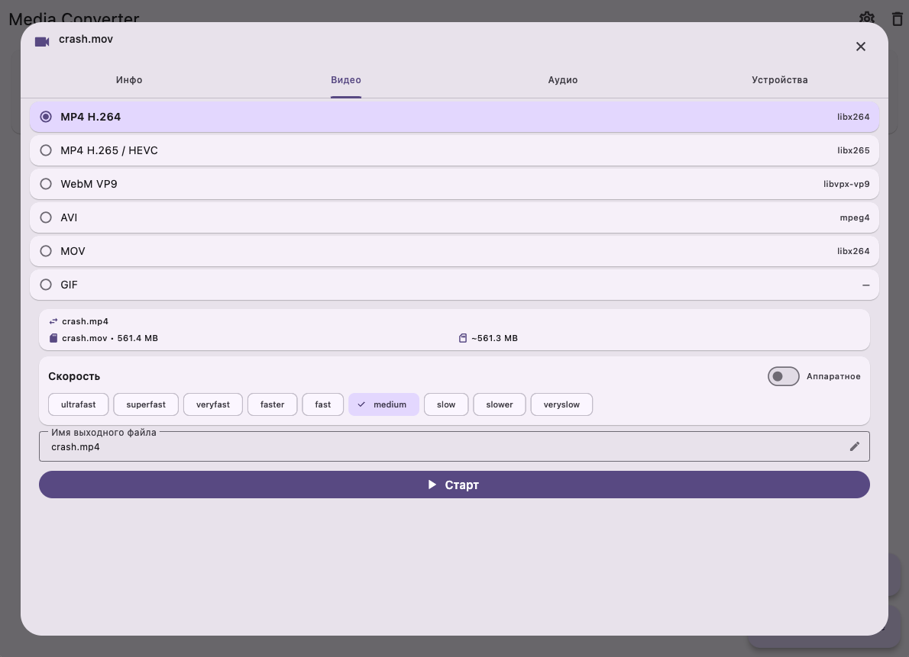
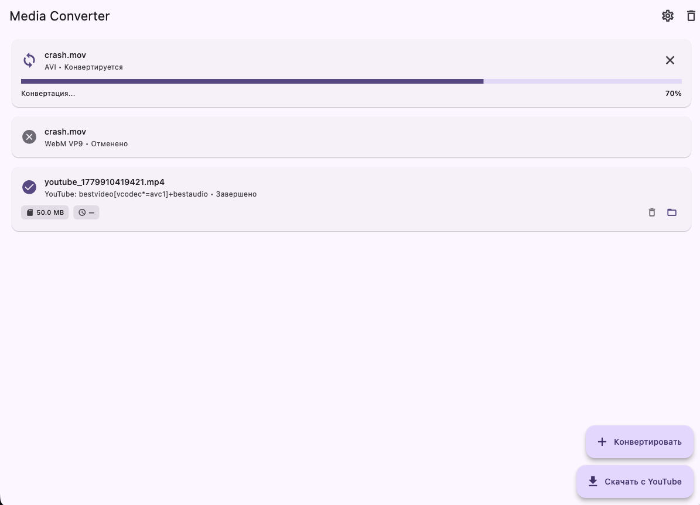
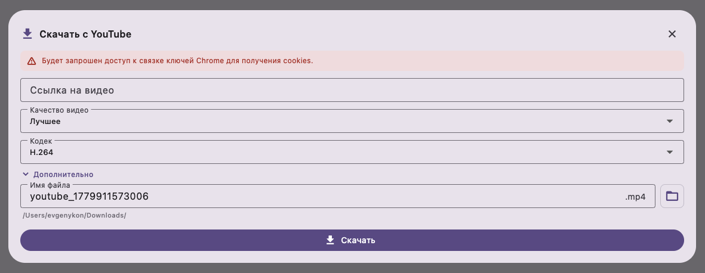

# Media Converter

Desktop tool for video/audio conversion using FFmpeg, with YouTube download support.

## Screenshots





## Dependencies

| Dependency | Install | Required for |
|---|---|---|
| [FFmpeg](https://ffmpeg.org/) | `brew install ffmpeg` / `winget install ffmpeg` | Video/audio conversion |
| [yt-dlp](https://github.com/yt-dlp/yt-dlp) | `brew install yt-dlp` / `winget install yt-dlp` | YouTube downloads |

```bash
# macOS
brew install ffmpeg yt-dlp

# Windows
winget install ffmpeg yt-dlp
```

On first launch, the app will check for FFmpeg and offer to install it via Homebrew.

## Building

```bash
# Debug build and run (macOS)
make run

# Release build (macOS)
make release VERSION=1.0.0
# → dist/media_converter-1.0.0-macos.zip
```

### Windows

```bash
flutter build windows --release
# → build\windows\x64\runner\Release\
```

### GitHub Actions

Push a tag to automatically build both platforms:

```bash
git tag v1.0.0
git push origin v1.0.0
```

## Makefile Commands

| Command | Description |
|---|---|
| `make setup` | Install dependencies |
| `make analyze` | Run the Dart analyzer |
| `make test` | Run all tests |
| `make run` | Build and launch on macOS |
| `make release VERSION=x.y.z` | Build release version and create ZIP archive |
| `make clean` | Clean build artifacts |
| `make purge` | Clean everything (derived data, caches) |
| `make format` | Format Dart source code |
| `make doctor` | Check Flutter installation status |

## Download

Pre-built binaries are available on the [Releases](https://github.com/evgenykon/media-converter/releases) page.

1. Download `media_converter-*-macos.zip` or `media_converter-*-windows.zip`
2. Extract and move to Applications
3. Run `brew install ffmpeg yt-dlp` (macOS) or `winget install ffmpeg yt-dlp` (Windows)
4. Open the app

## Features

- Video conversion between formats (MP4, WebM, AVI, MOV, GIF, etc.)
- Audio extraction (MP3, AAC, FLAC, OGG)
- YouTube video/audio download with quality, codec, subtitle selection
- Hardware acceleration (VideoToolbox on macOS)
- 13 built-in conversion presets
- Conversion history with folder access
- System notifications
